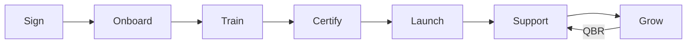

# Partner Enablement Templates

Train, support, and grow successful partners.

Enablement templates help you activate signed partners and drive ongoing success.

---

## Templates

<a href="01-roadmap/" class="template-card">
<h4>🛣️ Enablement Roadmap</h4>

Plan the partner learning journey from onboarding to advanced certification.

</a>

<a href="02-training-deck/" class="template-card">
<h4>🎓 Training Deck</h4>

Core training materials for partner sales and technical teams.

</a>

<a href="03-certification/" class="template-card">
<h4>🏅 Certification Program</h4>

Design certification tracks with requirements and benefits.

</a>

<a href="04-co-marketing/" class="template-card">
<h4>📣 Co-Marketing Playbook</h4>

Joint marketing activities, MDF programs, and campaign templates.

</a>

<a href="05-technical-integration/" class="template-card">
<h4>🔌 Technical Integration Guide</h4>

API documentation, integration patterns, and technical requirements.

</a>

<a href="06-success-metrics/" class="template-card">
<h4>📈 Success Metrics</h4>

KPIs, dashboards, and measurement frameworks for partner performance.

</a>

<a href="07-qbr-template/" class="template-card">
<h4>🗓️ QBR Template</h4>

Quarterly business review structure with scorecards and action planning.

</a>

---

## Partner Journey

| Phase | Templates | Timeline |
|-------|-----------|----------|
| **Onboard** | [Enablement Roadmap](01-roadmap.md) | Week 1-2 |
| **Train** | [Training Deck](02-training-deck.md) | Week 2-4 |
| **Certify** | [Certification Program](03-certification.md) | Week 4-8 |
| **Launch** | [Co-Marketing](04-co-marketing.md) | Week 6+ |
| **Ongoing** | [Success Metrics](06-success-metrics.md), [QBR](07-qbr-template.md) | Quarterly |

---

## Success Metrics

Track these KPIs for each partner:

| Metric | Description | Target |
|--------|-------------|--------|
| **Time to First Deal** | Days from signing to first closed deal | < 90 days |
| **Certification Rate** | % of partner team certified | > 80% |
| **Pipeline Generated** | Partner-sourced pipeline value | Varies by tier |
| **Revenue** | Partner-influenced closed revenue | Varies by tier |
| **Engagement Score** | Portal logins, training completion, etc. | > 70% |

[Success Metrics Template →](06-success-metrics.md)

---

## QBR Cadence

| Partner Tier | QBR Frequency | Duration |
|--------------|---------------|----------|
| Strategic | Monthly | 90 min |
| Gold | Quarterly | 60 min |
| Silver | Semi-annually | 45 min |
| Registered | Annually | 30 min |

[QBR Template →](07-qbr-template.md)

!!! tip "QBR Best Practice"
    Send the QBR document to your partner **one week before** the meeting so they can review data and come prepared.
