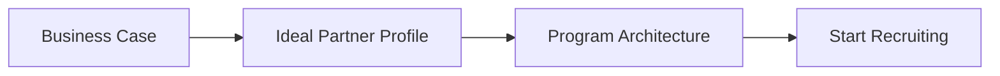
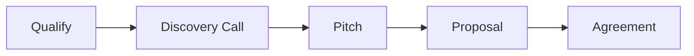

# Quick Start Guide

Get up and running with PartnerOS in under 5 minutes.

## Choose Your Path

=== ":material-file-document: Just the Templates"

    **Best for:** Teams who want to browse and use templates directly.

    1. Browse the template sections:
        - [Strategy](../strategy/) - Define your partnership vision
        - [Recruitment](../recruitment/) - Find and sign partners
        - [Enablement](../enablement/) - Train and support partners

    2. Find a template that fits your need

    3. Copy the content and customize for your company

=== ":material-robot: Partner Agent (AI)"

    **Best for:** Teams who want AI-assisted playbook execution.

    ```bash
    # Clone the repo
    git clone https://github.com/danieloleary/PartnerOS.git
    cd PartnerOS/scripts/partner_agent

    # Install dependencies
    pip install -r requirements.txt

    # Set your API key
    export ANTHROPIC_API_KEY=sk-ant-...
    # or
    export OPENAI_API_KEY=sk-...

    # Run interactively
    python agent.py
    ```

=== ":material-web: Self-Host Docs"

    **Best for:** Teams who want their own internal documentation site.

    ```bash
    # Clone the repo
    git clone https://github.com/danieloleary/PartnerOS.git
    cd PartnerOS

    # Install MkDocs
    pip install mkdocs-material

    # Preview locally
    mkdocs serve

    # Deploy to GitHub Pages
    mkdocs gh-deploy
    ```

---

## Template Structure

Every template follows a consistent structure:

```markdown
---
title: Template Name
description: What this template is for
keywords: [searchable, tags]
---

## How to Use This Template

Step-by-step instructions...

---

# Template Name

## Section 1
[Content with placeholders like [Your Company]]

## Section 2
[More content...]
```

!!! tip "Placeholders"
    Look for text in `[brackets]` - these are placeholders for you to fill in with your specific information.

---

## Recommended Workflow

### For New Partner Programs



1. Start with [Partner Business Case](../strategy/01-partner-business-case.md)
2. Define your [Ideal Partner Profile](../strategy/02-ideal-partner-profile.md)
3. Design your [Program Architecture](../strategy/06-program-architecture.md)
4. Begin [Recruitment](../recruitment/)

### For Signing a Specific Partner



1. Use the [Qualification Framework](../recruitment/03-qualification-framework.md)
2. Run a [Discovery Call](../recruitment/04-discovery-call.md)
3. Present the [Pitch Deck](../recruitment/05-pitch-deck.md)
4. Send a [Proposal](../recruitment/07-proposal.md)

### For Ongoing Management

- Run quarterly [QBRs](../enablement/07-qbr-template.md)
- Track [Success Metrics](../enablement/06-success-metrics.md)
- Update [ICP Alignment](../recruitment/10-icp-tracker.md)

---

## Next Steps

<div class="grid">

<div class="card" markdown>

### :material-book-open-variant: Learn the Lifecycle
Understand the partner journey from strategy to enablement.

[Partner Lifecycle →](lifecycle.md)

</div>

<div class="card" markdown>

### :material-pencil: Customize Templates
Tips for making templates your own.

[How to Use Templates →](how-to-use.md)

</div>

</div>
