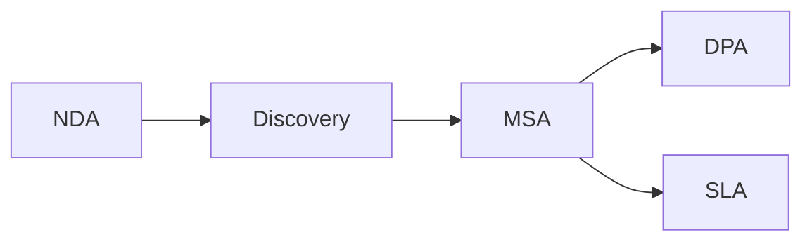

# Partner Legal Templates

Protect your business with proper legal frameworks.

Legal templates cover the full contract lifecycle from initial NDA through MSA and ongoing compliance.

---

## Templates

<a href="01-nda/" class="template-card">
<h4>:material-file-lock: Mutual NDA</h4>

Non-disclosure agreement for protecting confidential information during partner discussions.

</a>

<a href="02-msa/" class="template-card">
<h4>:material-file-sign: Master Service Agreement</h4>

Comprehensive legal and commercial framework for formal partnerships.

</a>

<a href="03-dpa/" class="template-card">
<h4>:material-shield-lock: Data Processing Agreement</h4>

GDPR and privacy compliance framework for partners processing personal data.

</a>

<a href="04-sla/" class="template-card">
<h4>:material-clock-check: Service Level Agreement</h4>

Support response times, escalation procedures, and service commitments.

</a>

---

## Contract Flow

| Stage | Template | When to Use |
|-------|----------|-------------|
| **Initial Discussions** | [Mutual NDA](01-nda.md) | Before sharing confidential information |
| **Formal Partnership** | [Master Service Agreement](02-msa.md) | When signing a partner |
| **Data Sharing** | [Data Processing Agreement](03-dpa.md) | When processing personal data |
| **Support Commitments** | [Service Level Agreement](04-sla.md) | For Silver and Gold tier partners |

---

!!! tip "Legal Best Practice"
    Always execute an NDA before sharing confidential business information. Have legal counsel review all agreements before execution.
