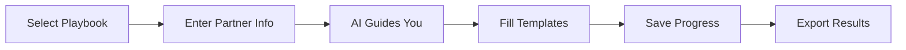

# Partner Agent

AI-powered assistant that runs partnership playbooks end-to-end.

The Partner Agent guides you through complex workflows like recruiting a new partner or conducting a QBR, using AI to help fill templates and provide expert recommendations.

---

## Quick Start

```bash
# Navigate to the agent
cd scripts/partner_agent

# Install dependencies
pip install -r requirements.txt

# Set your API key
export ANTHROPIC_API_KEY=sk-ant-...
# or
export OPENAI_API_KEY=sk-...

# Run interactively
python agent.py
```

---

## Playbooks

<div class="template-grid">

<a href="playbooks/#recruit" class="template-card">
<h4>:material-account-plus: Recruit</h4>
<p>Sign a new partner from qualification through agreement.</p>
</a>

<a href="playbooks/#onboard" class="template-card">
<h4>:material-rocket-launch: Onboard</h4>
<p>Activate a signed partner with training and first wins.</p>
</a>

<a href="playbooks/#qbr" class="template-card">
<h4>:material-calendar-check: QBR</h4>
<p>Conduct quarterly business reviews with metrics and planning.</p>
</a>

<a href="playbooks/#expand" class="template-card">
<h4>:material-arrow-expand: Expand</h4>
<p>Grow an existing partnership with deeper investment.</p>
</a>

<a href="playbooks/#exit" class="template-card">
<h4>:material-door-open: Exit</h4>
<p>End a partnership gracefully while protecting relationships.</p>
</a>

</div>

---

## How It Works



1. **Select a Playbook** - Choose the workflow you want to run
2. **Enter Partner Info** - Provide the partner name and context
3. **AI Guides You** - Answer questions as the agent asks them
4. **Fill Templates** - The agent populates templates with your answers
5. **Save Progress** - State is saved so you can resume anytime
6. **Export Results** - Get filled templates ready to use

---

## Usage Examples

=== "Interactive Mode"

    ```bash
    python agent.py
    ```

    ```
    Partner Agent v1.0
    ==================

    What would you like to do?
    1. Start a new playbook
    2. Continue existing playbook
    3. View partner status
    4. List templates
    5. Exit

    > 1

    Available playbooks:
    - recruit: New Partner Recruitment
    - onboard: Partner Onboarding
    - qbr: Quarterly Business Review

    Select playbook: recruit
    Partner name: Acme Corp

    Starting 'New Partner Recruitment' playbook...
    ```

=== "Direct Playbook"

    ```bash
    python agent.py --playbook recruit --partner "Acme Corp"
    ```

=== "View Status"

    ```bash
    python agent.py --status
    ```

    ```
    Partner Status
    ┏━━━━━━━━━━━━━┳━━━━━━━━┳━━━━━━━━━━━━━━━━━━┓
    ┃ Partner     ┃ Stage  ┃ Active Playbooks ┃
    ┡━━━━━━━━━━━━━╇━━━━━━━━╇━━━━━━━━━━━━━━━━━━┩
    │ Acme Corp   │ recruit│ recruit (step 3) │
    │ TechPartner │ onboard│ -                │
    └─────────────┴────────┴──────────────────┘
    ```

---

## GitHub Actions

Run playbooks directly from GitHub with the click of a button.

1. Go to **Actions** → **Run Partner Agent**
2. Click **Run workflow**
3. Select playbook and enter partner name
4. View results in the workflow summary

!!! warning "Setup Required"
    Add `ANTHROPIC_API_KEY` or `OPENAI_API_KEY` to your repository secrets first.

---

## Next Steps

- [Setup Guide](setup.md/) - Detailed installation and configuration
- [Playbooks](playbooks.md/) - Deep dive into each playbook
- [Configuration](configuration.md/) - Customize the agent
