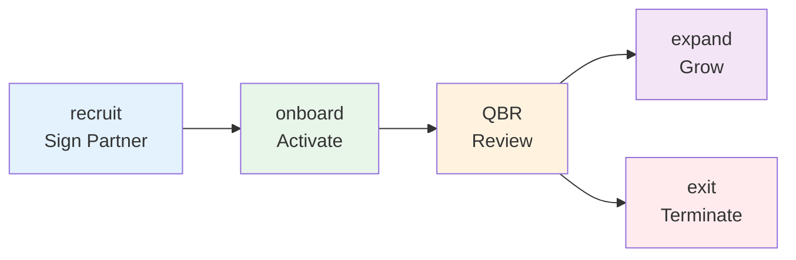
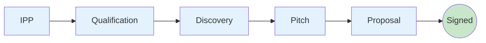
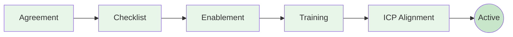
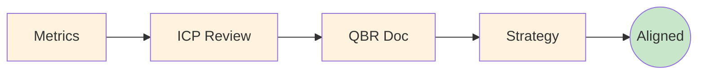
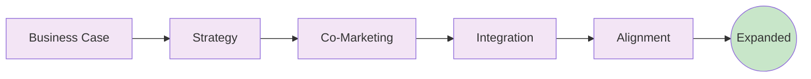
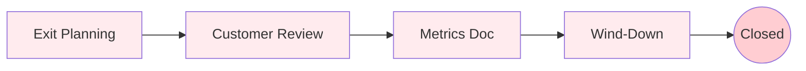

# Playbooks

Playbooks are pre-defined workflows that guide you through common partnership scenarios.

---

## Overview

| Playbook | Templates | Use Case |
|----------|-----------|----------|
| `recruit` | 5 | Sign a new partner |
| `onboard` | 5 | Activate a signed partner |
| `qbr` | 4 | Quarterly business review |
| `expand` | 5 | Grow an existing partnership |
| `exit` | 4 | End a partnership gracefully |

## Playbook Flow Visualization



---

## Recruit {#recruit}

**Purpose:** Take a partner prospect from qualification through signed agreement.

<div class="playbook-flow">
  <span class="playbook-step">Ideal Partner Profile</span>
  <span class="playbook-arrow">→</span>
  <span class="playbook-step">Qualification</span>
  <span class="playbook-arrow">→</span>
  <span class="playbook-step">Discovery</span>
  <span class="playbook-arrow">→</span>
  <span class="playbook-step">Pitch</span>
  <span class="playbook-arrow">→</span>
  <span class="playbook-step">Proposal</span>
</div>

### Steps

| Step | Template | What Happens |
|------|----------|--------------|
| 1 | [Ideal Partner Profile]((../strategy/02-ideal-partner-profile.md/)) | Evaluate if partner matches your IPP |
| 2 | [Qualification Framework]((../recruitment/03-qualification-framework.md/)) | Score partner on fit criteria |
| 3 | [Discovery Call Script]((../recruitment/04-discovery-call.md/)) | Prepare qualification call |
| 4 | [Pitch Deck]((../recruitment/05-pitch-deck.md/)) | Customize your pitch |
| 5 | [Proposal Template]((../recruitment/07-proposal.md/)) | Draft the partnership proposal |



### Run It

```bash
python agent.py --playbook recruit --partner "Acme Corp"
```

### Success Criteria

- [ ] Partner matches IPP
- [ ] Qualification score > threshold
- [ ] Discovery call completed
- [ ] Pitch delivered
- [ ] Proposal sent

---

## Onboard {#onboard}

**Purpose:** Activate a newly signed partner with training and first wins.

<div class="playbook-flow">
  <span class="playbook-step">Agreement</span>
  <span class="playbook-arrow">→</span>
  <span class="playbook-step">Checklist</span>
  <span class="playbook-arrow">→</span>
  <span class="playbook-step">Enablement</span>
  <span class="playbook-arrow">→</span>
  <span class="playbook-step">Training</span>
  <span class="playbook-arrow">→</span>
  <span class="playbook-step">ICP Alignment</span>
</div>

### Steps

| Step | Template | What Happens |
|------|----------|--------------|
| 1 | [Agreement Template]((../recruitment/08-agreement.md/)) | Finalize partnership agreement |
| 2 | [Onboarding Checklist]((../recruitment/09-onboarding.md/)) | Track activation tasks |
| 3 | [Enablement Roadmap]((../enablement/01-roadmap.md/)) | Plan learning journey |
| 4 | [Training Deck]((../enablement/02-training-deck.md/)) | Customize training plan |
| 5 | [ICP Alignment Tracker]((../recruitment/10-icp-tracker.md/)) | Align on target accounts |



### Run It

```bash
python agent.py --playbook onboard --partner "Acme Corp"
```

### Success Criteria

- [ ] Agreement signed
- [ ] Portal access granted
- [ ] Team trained
- [ ] First opportunity registered

---

## QBR {#qbr}

**Purpose:** Conduct a structured quarterly business review.

<div class="playbook-flow">
  <span class="playbook-step">Metrics</span>
  <span class="playbook-arrow">→</span>
  <span class="playbook-step">ICP Review</span>
  <span class="playbook-arrow">→</span>
  <span class="playbook-step">QBR Doc</span>
  <span class="playbook-arrow">→</span>
  <span class="playbook-step">Strategy</span>
</div>

### Steps

| Step | Template | What Happens |
|------|----------|--------------|
| 1 | [Success Metrics]((../enablement/06-success-metrics.md/)) | Gather performance data |
| 2 | [ICP Alignment Tracker]((../recruitment/10-icp-tracker.md/)) | Review pipeline and accounts |
| 3 | [QBR Template]((../enablement/07-qbr-template.md/)) | Prepare full QBR document |
| 4 | [Strategy Plan]((../strategy/05-strategy-plan.md/)) | Update strategic alignment |



### Run It

```bash
python agent.py --playbook qbr --partner "Acme Corp"
```

### Success Criteria

- [ ] Metrics compiled
- [ ] QBR document prepared
- [ ] Meeting conducted
- [ ] Action items assigned

---

## Expand {#expand}

**Purpose:** Deepen investment in a successful partnership.

<div class="playbook-flow">
  <span class="playbook-step">Business Case</span>
  <span class="playbook-arrow">→</span>
  <span class="playbook-step">Strategy</span>
  <span class="playbook-arrow">→</span>
  <span class="playbook-step">Co-Marketing</span>
  <span class="playbook-arrow">→</span>
  <span class="playbook-step">Integration</span>
  <span class="playbook-arrow">→</span>
  <span class="playbook-step">Alignment</span>
</div>

### Steps

| Step | Template | What Happens |
|------|----------|--------------|
| 1 | [Partner Business Case]((../strategy/01-partner-business-case.md/)) | Build expansion business case |
| 2 | [Partner Strategy Plan]((../strategy/05-strategy-plan.md/)) | Update partnership strategy |
| 3 | [Co-Marketing Playbook]((../enablement/04-co-marketing.md/)) | Plan joint marketing |
| 4 | [Technical Integration]((../enablement/05-technical-integration.md/)) | Deepen integration |
| 5 | [Internal Alignment]((../strategy/07-internal-alignment.md/)) | Get internal buy-in |



### Run It

```bash
python agent.py --playbook expand --partner "Acme Corp"
```

### Success Criteria

- [ ] Expansion justified
- [ ] New initiatives planned
- [ ] Resources committed
- [ ] Tier upgrade (if applicable)

---

## Exit {#exit}

**Purpose:** End a partnership professionally while protecting customers.

<div class="playbook-flow">
  <span class="playbook-step">Exit Planning</span>
  <span class="playbook-arrow">→</span>
  <span class="playbook-step">Customer Review</span>
  <span class="playbook-arrow">→</span>
  <span class="playbook-step">Metrics Doc</span>
  <span class="playbook-arrow">→</span>
  <span class="playbook-step">Wind-Down</span>
</div>

### Steps

| Step | Template | What Happens |
|------|----------|--------------|
| 1 | [Exit Checklist]((../strategy/08-exit-checklist.md/)) | Plan the exit process |
| 2 | [ICP Alignment Tracker]((../recruitment/10-icp-tracker.md/)) | Review affected customers |
| 3 | [Success Metrics]((../enablement/06-success-metrics.md/)) | Document final performance |
| 4 | [Exit Checklist]((../strategy/08-exit-checklist.md/)) | Execute wind-down |



### Run It

```bash
python agent.py --playbook exit --partner "Acme Corp"
```

!!! warning "Handle with Care"
    Exit playbooks should only be run after leadership approval and legal consultation.

### Success Criteria

- [ ] Customers transitioned
- [ ] Access revoked
- [ ] Finances settled
- [ ] Post-mortem completed

---

## Creating Custom Playbooks

Add new playbooks by creating YAML files in `playbooks/`:

```yaml
name: Partner Renewal
description: Annual partnership renewal process
steps:
  - template: III_Partner_Enablement_Templates/06-success-metrics.md
    name: Review Metrics
    prompt: |
      Review the partner's performance over the past year.

  - template: III_Partner_Enablement_Templates/07_Partner_QBR_Template.md
    name: Renewal Discussion
    prompt: |
      Prepare talking points for the renewal conversation.
```

See [Configuration]((configuration.md/)) for more customization options.
