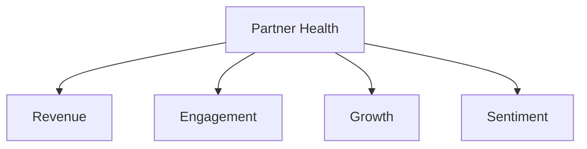

# Partner Analysis Templates

Measure partner program success with analytics and assessments.

Analysis templates help you track partner performance, identify at-risk relationships, and make data-driven decisions.

---

## Templates

<a href="01-health-scorecard/" class="template-card">
<h4>:material-heart-pulse: Partner Health Scorecard</h4>

Quarterly assessment of partner engagement, performance, and growth potential.

</a>

---

## When to Use

| Situation | Template |
|-----------|----------|
| Quarterly partner review | [Health Scorecard]((01-health-scorecard.md/)) |
| Identify at-risk partners | [Health Scorecard]((01-health-scorecard.md/)) |
| Plan engagement activities | [Health Scorecard]((01-health-scorecard.md/)) |

## Health Scorecard Dimensions

| Dimension | What to Measure |
|-----------|-----------------|
| Revenue | Pipeline, closed-won, growth rate |
| Engagement | Meetings, certifications, co-marketing |
| Growth | New opportunities, expanding accounts |
| Sentiment | NPS, feedback, relationship quality |

!!! tip "Pro Tip"
    Review health scores monthly and reach out to partners showing declining metrics before they become at-risk.
