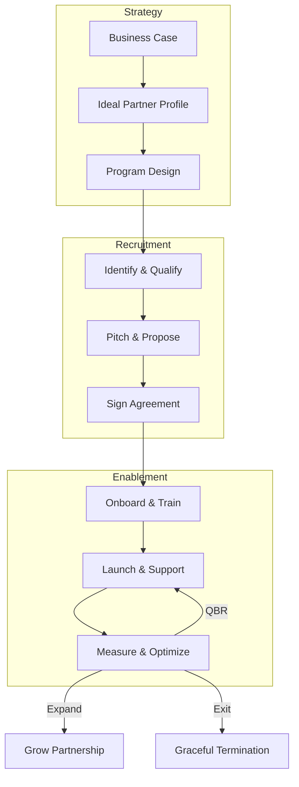
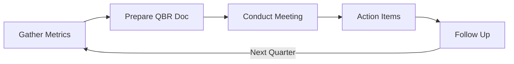

# Partner Lifecycle

Every successful partnership follows a predictable lifecycle. PartnerOS provides templates for each phase.



---

## Phase 1: Strategy

**Goal:** Define *why* you need partners and *who* you're looking for.

| Template | Purpose |
|----------|---------|
| [Partner Business Case](../strategy/01-partner-business-case/) | Justify the investment in partnerships |
| [Ideal Partner Profile](../strategy/02-ideal-partner-profile/) | Define your target partner characteristics |
| [3C/4C Evaluation](../strategy/03-evaluation-framework/) | Framework for assessing partner fit |
| [Competitive Differentiation](../strategy/04-competitive-differentiation/) | Position against competitor programs |
| [Partner Strategy Plan](../strategy/05-strategy-plan/) | Overall partnership strategy document |
| [Program Architecture](../strategy/06-program-architecture/) | Design tiers, benefits, requirements |
| [Internal Alignment](../strategy/07-internal-alignment/) | Get buy-in across your organization |

!!! tip "Start Here"
    If you're building a partner program from scratch, start with the **Business Case** to align stakeholders, then define your **Ideal Partner Profile**.

---

## Phase 2: Recruitment

**Goal:** Find, qualify, and sign the right partners.

| Template | Purpose |
|----------|---------|
| [Email Sequences](../recruitment/01-email-sequence/) | Outreach templates for prospecting |
| [Outreach Engagement](../recruitment/02-outreach-engagement/) | Multi-touch engagement cadence |
| [Qualification Framework](../recruitment/03-qualification-framework/) | Score and prioritize prospects |
| [Discovery Call Script](../recruitment/04-discovery-call/) | Structured qualification call |
| [Partner Pitch Deck](../recruitment/05-pitch-deck/) | Present your partner program |
| [Partnership One-Pager](../recruitment/06-one-pager/) | Quick overview for prospects |
| [Proposal Template](../recruitment/07-proposal/) | Formal partnership proposal |
| [Agreement Template](../recruitment/08-agreement/) | Legal partnership agreement |
| [Onboarding Checklist](../recruitment/09-onboarding/) | Activation checklist |
| [ICP Alignment Tracker](../recruitment/10-icp-tracker/) | Track customer overlap |

!!! example "Typical Recruitment Flow"
    ```
    Outreach → Discovery Call → Pitch → Proposal → Agreement → Onboarding
    ```

---

## Phase 3: Enablement

**Goal:** Train, support, and grow successful partners.

| Template | Purpose |
|----------|---------|
| [Enablement Roadmap](../enablement/01-roadmap/) | Plan partner learning journey |
| [Training Deck](../enablement/02-training-deck/) | Core training materials |
| [Certification Program](../enablement/03-certification/) | Design certification tracks |
| [Co-Marketing Playbook](../enablement/04-co-marketing/) | Joint marketing activities |
| [Technical Integration](../enablement/05-technical-integration/) | Integration guidance |
| [Success Metrics](../enablement/06-success-metrics/) | KPIs and measurement |
| [QBR Template](../enablement/07-qbr-template/) | Quarterly business reviews |

---

## Ongoing Operations

### Quarterly Business Reviews

Run QBRs to maintain alignment and drive growth:



[QBR Template →](../enablement/07-qbr-template/)

### Partner Expansion

When a partnership is thriving, use these to grow:

- Update [Partner Strategy Plan](../strategy/05-strategy-plan/)
- Expand [Co-Marketing](../enablement/04-co-marketing/)
- Deepen [Technical Integration](../enablement/05-technical-integration/)

### Partner Exit

When it's time to part ways, do it gracefully:

[Partner Exit Checklist →](../strategy/08-exit-checklist/)

---

## Partner Agent Playbooks

The [Partner Agent](../agent/) automates these workflows:

| Playbook | Lifecycle Phase | Templates Used |
|----------|-----------------|----------------|
| `recruit` | Recruitment | IPP → Qualification → Discovery → Pitch → Proposal |
| `onboard` | Enablement | Agreement → Checklist → Roadmap → Training |
| `qbr` | Ongoing | Metrics → ICP Review → QBR → Strategy |
| `expand` | Growth | Business Case → Strategy → Co-Marketing |
| `exit` | Termination | Exit Checklist → Customer Transition |

[Learn about Partner Agent →](../agent/)
