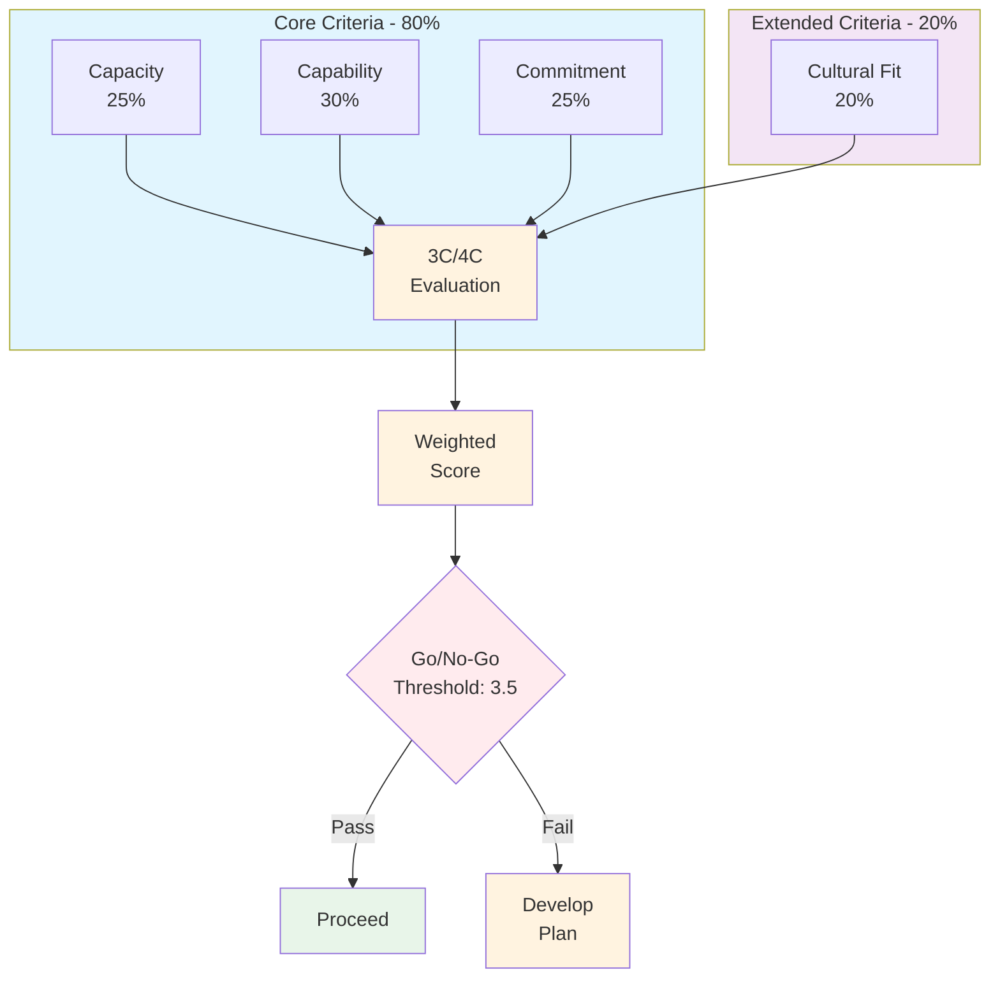
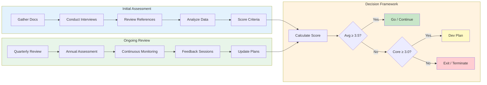

## How to Use This Template

**Purpose:**
Use this framework to objectively evaluate potential partners and assess ongoing partner performance.

**Steps:**
1. Review each criterion and its components.
2. Gather relevant data and evidence.
3. Score each component objectively.
4. Calculate overall scores.
5. Use results to inform decisions and action plans.

---

# 3C/4C Partner Evaluation Framework

## Framework Overview

---

## Core Criteria (3C)

### 1. Capacity
*Does the partner have the fundamental resources and infrastructure to effectively partner with us and serve our mutual customers?*

#### Dedicated Human Resources
- Headcount allocation (sales, pre-sales/SEs, consultants, support)
- Quality and experience level of assigned personnel
- Practice lead or center of excellence presence
- Training and certification status

#### Financial Stability & Health
- Financial statements review
- Credit reports
- Payment history
- Investment capability
- Growth trajectory

#### Scalability & Reach
- Regional/national/global coverage
- Market penetration depth
- Resource scaling capability
- Operational infrastructure
  - CRM systems
  - PSA tools
  - Support systems
  - Growth management

### 2. Capability
*Does the partner possess the necessary skills, expertise, and experience to successfully market, sell, implement, and support our solutions?*

#### Technical Proficiency & Certifications
- Required certifications held
- Number of certified individuals
- Certification maintenance plan
- Technical specialization areas
- Integration capabilities

#### Solution Delivery Expertise
- Implementation track record
- Service delivery methodology
- Quality assurance processes
- Support capabilities
- Custom development skills

#### Sales & Marketing Capabilities
- Sales team structure
- Pipeline management
- Marketing resources
- Demand generation
- Co-marketing experience

#### Customer Success
- Customer satisfaction metrics
- Support infrastructure
- Success methodology
- Reference accounts
- Case studies

### 3. Commitment
*Is the partner genuinely committed to the partnership and willing to invest in its success?*

#### Resource Investment
- Dedicated personnel
- Training investment
- Marketing funds
- Technical resources
- Support infrastructure

#### Executive Sponsorship
- C-level engagement
- Strategic alignment
- Resource commitment
- Quarterly business reviews
- Long-term vision

#### Market Focus
- Target market alignment
- Competitive positioning
- Growth strategy
- Market penetration
- Customer focus

#### Performance Metrics
- Sales targets
- Certification goals
- Customer success metrics
- Support SLAs
- Growth objectives

## Extended Criteria (4C)

### 4. Cultural Fit
*Does the partner's culture, values, and business approach align with ours?*

#### Company Values
- Mission alignment
- Vision compatibility
- Business ethics
- Customer focus
- Innovation mindset

#### Business Practices
- Sales methodology
- Customer engagement
- Support philosophy
- Quality standards
- Compliance approach

#### Team Dynamics
- Communication style
- Decision-making process
- Problem-solving approach
- Collaboration willingness
- Conflict resolution

#### Market Reputation
- Industry standing
- Customer references
- Partner testimonials
- Market perception
- Brand alignment

## Scoring System

### Rating Scale
1. **Exceptional (5)**
   - Exceeds all expectations
   - Best-in-class performance
   - Industry leader
   - Strategic differentiator

2. **Strong (4)**
   - Meets all expectations
   - Consistent performance
   - Reliable partner
   - Growth potential

3. **Adequate (3)**
   - Meets basic requirements
   - Room for improvement
   - Development needed
   - Potential risk areas

4. **Weak (2)**
   - Below expectations
   - Significant gaps
   - High risk areas
   - Immediate action needed

5. **Critical (1)**
   - Major concerns
   - Deal-breaker issues
   - Immediate intervention required
   - Consider termination

### Weighting System
- Capacity: 25%
- Capability: 30%
- Commitment: 25%
- Cultural Fit: 20%

## Evaluation Process

### Initial Assessment
1. Gather required documentation
2. Conduct interviews
3. Review references
4. Analyze historical data
5. Score each criterion

### Ongoing Review
1. Quarterly performance review
2. Annual comprehensive assessment
3. Continuous monitoring
4. Regular feedback sessions
5. Action plan updates

### Decision Framework
- **Go/No-Go Threshold:** Minimum 3.5 average score
- **Critical Areas:** Must score at least 3.0 in each core criterion
- **Improvement Plans:** Required for scores below 3.0
- **Termination Triggers:** Scores below 2.0 in critical areas

## Action Planning

### Development Plans
- Specific improvement areas
- Action items
- Timeline
- Resource requirements
- Success metrics

### Support Requirements
- Training needs
- Enablement resources
- Marketing support
- Technical assistance
- Operational support

### Risk Mitigation
- Risk identification
- Mitigation strategies
- Contingency plans
- Monitoring metrics
- Review schedule

---

## Pro Tips

1. **Objective Assessment:**
   - Use data-driven metrics
   - Avoid personal bias
   - Consider multiple perspectives
   - Document evidence

2. **Regular Reviews:**
   - Schedule quarterly assessments
   - Track progress over time
   - Update action plans
   - Adjust scoring as needed

3. **Communication:**
   - Share results transparently
   - Set clear expectations
   - Provide constructive feedback
   - Celebrate successes

4. **Continuous Improvement:**
   - Learn from assessments
   - Refine evaluation criteria
   - Update best practices
   - Share learnings

---

## Related Templates
- [Ideal Partner Profile]((02-ideal-partner-profile.md/))
- [Partner Strategy Plan]((05-strategy-plan.md/))
