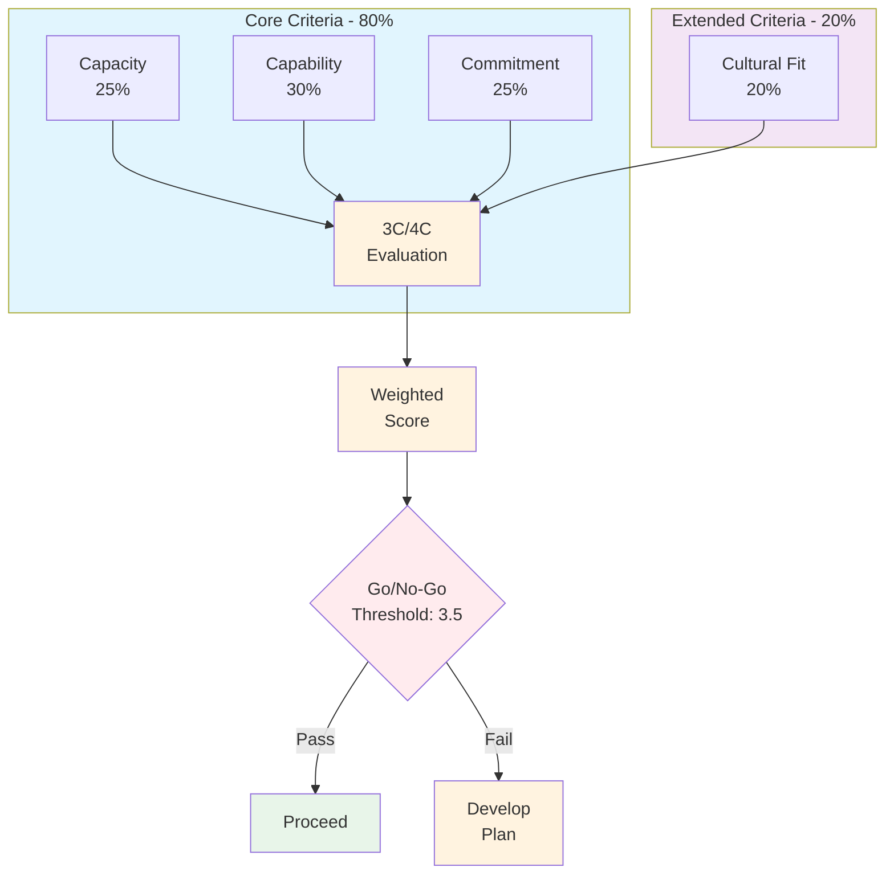

> **The partner evaluation score is only as good as the questions you ask. Skip the hard questions now, and you'll be explaining the partnership failure later.** — Dan O'Leary

:::tip[Insider Tip]
The 3C framework originated in Japanese business (1990s) for strategic alliances. The 4C adds "Cultural Fit" which became essential as Western partnership programs matured. Use 3C for transactional relationships, 4C for strategic partnerships.
:::

## How to Use This Template

**Purpose:**
This framework transforms subjective partner evaluations into objective, comparable scores. It gives you defensible decisions—whether you're signing a new partner, tiering existing ones, or deciding to exit.

**Why It Works:**
Without scoring, partner decisions become political. "I just have a good feeling about them" doesn't survive CFO scrutiny. A scored framework creates audit trails, enables comparison, and surfaces the hard questions before they become expensive mistakes.

**Steps:**

1. **Define your weightings** — 3C vs 4C and the specific percentages (30 min)
2. **Gather evidence** — Financials, certifications, references, CRM data (1-2 hours)
3. **Score each criterion** — Be ruthless; 3 means "meets minimum," not "pretty good" (30 min)
4. **Calculate weighted score** — Capacity 25%, Capability 30%, Commitment 25%, Cultural Fit 20%
5. **Apply decision framework** — Go/No-Go threshold is 3.5 minimum (15 min)

---

# The 3C/4C Framework

## Framework Overview

The 3C framework evaluates partners on three core dimensions. Add Cultural Fit for strategic partnerships requiring long-term collaboration.



### When to Use 3C vs 4C

| Framework | Use Case | Weighting |
|-----------|----------|-----------|
| **3C** | Resellers, referral partners, transactional | Capacity 30%, Capability 40%, Commitment 30% |
| **4C** | Strategic SI partners, OEM, co-sell | Capacity 25%, Capability 30%, Commitment 25%, Cultural Fit 20% |

---

## 1. Capacity

*Does the partner have the fundamental resources and infrastructure to effectively partner with us and serve our mutual customers?*

Capacity is your table stakes. A partner with great capability but no capacity will disappoint customers—and your brand will suffer.

### Human Resources

This is the most visible capacity indicator. Ask specifically about the people who will work on your partnership—not the company's total headcount.

**What to evaluate:**

- **Dedicated personnel**: How many people are allocated to your partnership specifically? Not "we can assign people," but who's already booked?
- **Practice lead presence**: Is there a designated practice lead or center of excellence? What's their background?
- **Certification status**: How many certified professionals? What's the certification maintenance plan?
- **Experience level**: What's the tenure and background of assigned SEs, consultants, account managers?

**The question that reveals truth:**
Ask: "Who will be the day-to-day contact for our partnership, and what's their current allocation?" If they need to "check with the team," capacity isn't real yet.

**Example scoring:**
```
Human Resources Score: 3/5
├── Dedicated personnel: 3 assigned (2 SEs, 1 AM) → 3
├── Practice lead: Part-time (0.5 FTE) → 2
├── Certifications: 5 certified, renewals scheduled → 4
└── Experience: Mixed (2 senior, 1 junior) → 3
```

### Financial Stability

Financial health predicts partnership longevity. A partner with cash flow problems will prioritize survival over your partnership.

**What to evaluate:**

- **Revenue trajectory**: 3-year growth trend. Negative or flat is a warning sign.
- **Profitability**: Are they profitable, burning cash, or VC-funded?
- **Credit**: Payment history with other vendors, credit lines available.
- **Investment capacity**: Can they fund growth, or are they cash-constrained?

**Red flags:**

- Revenue declined 2+ years in a row
- No profit in 3+ years with no VC backing
- Payment disputes with current vendors
- Layoffs in past 12 months

**Metrics to verify:**

| Metric | Healthy | Warning |
|--------|---------|---------|
| YoY Revenue Growth | >15% | <0% |
| Gross Margin | >40% | <25% |
| Customer Retention | >90% | <80% |

### Scalability & Infrastructure

Can they grow with you? A partner who maxes out at $100K/year with you becomes a bottleneck.

**What to evaluate:**

- **Geographic coverage**: Where do they have presence? Does it match your target markets?
- **Technical infrastructure**: CRM, PSA, support systems? Are they using spreadsheets for everything?
- **Scaling capability**: Can they hire quickly if deals materialize? What's their hiring timeline?

**The scalability question:**
Ask: "If we gave you $500K in pipeline next quarter, what's your max capacity to deliver?" The answer reveals whether they're bottleneck or enabler.

---

## 2. Capability

*Does the partner possess the necessary skills, expertise, and experience to successfully market, sell, implement, and support our solutions?*

Capability is the easy part to evaluate—it's all documented. Certifications, case studies, reference calls. The hard part is distinguishing capability from potential.

### Technical Proficiency

Technical capability directly impacts customer success. A poorly implemented solution generates churn—and customers blame the vendor, not the partner.

**What to evaluate:**

- **Certifications**: What certifications do they hold? What's the pass rate? Are they current?
- **Implementation track record**: How many similar implementations? What's success rate?
- **Integration skills**: Can they build custom integrations? What's their integration methodology?
- **Support capabilities**: What's their support model? 24/7? SLA terms?

**The certification truth:**
Ask: "What's your first-attempt certification pass rate?" If it's below 70%, they're pushing bodies through rather than building expertise. High-quality partners have 85%+ pass rates.

**Metrics to track:**

| Capability Area | Target | How to Measure |
|----------------|--------|----------------|
| Implementation Success Rate | >90% | Post-project surveys |
| Time to First Deployment | <30 days | Project completion data |
| Support Resolution Time | <4 hours (P1) | Ticket tracking |
| Integration Delivery | On-time | Project milestones |

### Solution Delivery Expertise

Implementation is where partnerships are won or lost. I've seen brilliant sales relationships collapse because delivery couldn't execute.

**What to evaluate:**

- **Methodology**: Do they have documented implementation methodology? What's their approach?
- **Quality assurance**: How do they ensure delivery quality? Peer reviews? Checklists?
- **Custom development**: Can they build custom solutions, or only configure?
- **Reference customers**: Can they connect you with similar implementations?

**The reference call question:**
Don't just ask for references—ask to speak with a customer who had challenges. "Tell me about a time the implementation went sideways and how they recovered." The answer reveals more than any success story.

### Sales & Marketing Capabilities

A technically excellent partner who can't sell is useless. Sales capability determines pipeline.

**What to evaluate:**

- **Sales model**: Do they have dedicated partner reps? What's the incentive structure?
- **Pipeline management**: What's their CRM usage? Forecast accuracy?
- **Marketing investment**: What's their demand generation budget? Lead volume?
- **Co-marketing**: Will they co-brand? Co-fund campaigns? Content co-creation?

**The pipeline question:**
Ask for their current pipeline of opportunities that include your solutions. "Show me your active opportunities with deal registration or proposal submitted." If the pipeline is empty, capability is theoretical.

---

## 3. Commitment

*Is the partner genuinely committed to the partnership and willing to invest in its success?*

This is the hardest category to evaluate—and the most important. Capability is visible; commitment is promised.

### Resource Investment

Money talks. Partners who commit budget are committed. Partners who say "we'll see" are not.

**What to evaluate:**

- **Training budget**: What's allocated for certification and enablement?
- **Marketing funds**: What's committed to co-marketing?
- **Technical resources**: Who's dedicated to your solutions?
- **Support infrastructure**: What's the support model for your customers?

**The budget question:**
Ask: "What's your budget allocation for partnership development this year?" If they can't name a specific number—walk. "We believe in this partnership" doesn't pay invoices.

### Executive Sponsorship

Executive sponsorship determines resource priority. Without it, your partner contact becomes a hero-or-zero.

**What to evaluate:**

- **C-level engagement**: Has their CEO/EVP met with you? Will they?
- **Strategic alignment**: Is this a top-3 priority for their leadership?
- **QBR cadence**: Are quarterly business reviews scheduled and attended by executives?
- **Escalation path**: What's the escalation process when things go wrong?

**The executive test:**
Ask to meet their CEO—not as a courtesy, but as a strategic review. Partners who deflect "the CEO doesn't do these calls" are signaling you're a transactional vendor, not strategic partner.

### Performance Metrics

Commitment without metrics is aspiration. Strong partners commit to specific targets.

**What to evaluate:**

- **Revenue targets**: What's their committed revenue goal? Is it growing?
- **Certification goals**: How many certified professionals by when?
- **Customer success**: What's their NPS or CSAT target?
- **Growth objectives**: What's the plan for expanding the partnership?

**The target question:**
Ask: "What happens if you miss your revenue target?" If they say "we'll reassess our commitment," they've already told you the answer.

---

## 4. Cultural Fit

*Does the partner's culture, values, and business approach align with ours?*

Cultural Fit applies to strategic partnerships where you'll work closely together for years. Skip for transactional relationships.

### Values Alignment

Values misalignment creates friction that poisons partnerships.

**What to evaluate:**

- **Customer obsession**: Is customer success a priority or a slogan?
- **Integrity**: How do they handle difficult situations? References tell stories.
- **Innovation**: Do they experiment, or just replicate?
- **Long-term thinking**: Are they building for years or quarters?

**The values question:**
Ask reference customers: "On a scale of 1-10, would you partner with them again?" Scores below 8 reveal values gaps.

### Business Practices

How they do business reveals who they are.

**What to evaluate:**

- **Sales methodology**: Consultative or transactional? Relationship or procurement-driven?
- **Support philosophy**: White-glove or standard? Proactive or reactive?
- **Quality standards**: What's their bar for excellence?
- **Compliance**: How do they handle regulatory requirements?

### Team Dynamics

You'll work with their team daily. Poor dynamics make every interaction painful.

**What to evaluate:**

- **Communication style**: Direct and clear, or political and opaque?
- **Problem-solving**: Do they escalate or solve locally?
- **Collaboration**: Do they share information freely?
- **Conflict resolution**: How do they handle disagreements?

---

## Scoring System

### Rating Scale

| Score | Rating | Definition | Action |
|-------|--------|------------|--------|
| **5** | Exceptional | Exceeds all expectations; best-in-class | Strategic priority |
| **4** | Strong | Meets all expectations; reliable | Standard partnership |
| **3** | Adequate | Meets basic requirements; room for growth | Development plan |
| **2** | Weak | Below expectations; significant gaps | Turnaround plan |
| **1** | Critical | Major concerns; deal-breaker | Exit/terminate |

### Weighting System

Use these standard weightings, or adjust based on your priorities:

| Criterion | 3C Weight | 4C Weight | Rationale |
|-----------|-----------|-----------|------------|
| **Capacity** | 30% | 25% | Must have resources to deliver |
| **Capability** | 40% | 30% | Skills drive customer success |
| **Commitment** | 30% | 25% | Without commitment, nothing else matters |
| **Cultural Fit** | — | 20% | Strategic relationships require alignment |

---

## Decision Framework

Apply this decision matrix to every scored partner:

```mermaid
flowchart LR
    subgraph Initial[Calculate Weighted Score]
        A1[Score Each Criterion] --> A2[Apply Weightings]
        A2 --> A3[Get Weighted Average]
    end

    subgraph Decision{Decision Matrix}
        B1{Avg ≥ 3.5?} -->|Yes| B2[GO - Proceed]
        B1 -->|No| B2a{Core C's ≥ 3.0?}
        B2a -->|Yes| B3[Develop Plan]
        B2a -->|No| B4[Exit / Terminate]
    end

    A3 --> Decision

    style B2 fill:#c8e6c9
    style B3 fill:#fff9c4
    style B4 fill:#ffcdd2
```

### Decision Rules

| Score Range | Decision | Next Steps |
|-------------|----------|------------|
| **≥ 3.5** | Go | Proceed to contract; assign dedicated resources |
| **3.0 - 3.4** | Develop | Create 90-day improvement plan; reassess quarterly |
| **2.5 - 2.9** | Conditional | Significant investment required; monthly check-ins |
| **< 2.5** | No-Go | Exit gracefully; maintain as prospect for future |

### Critical Thresholds

These categories require a minimum score of 3.0—or automatic disqualification regardless of total score:

- Capability (technical delivery)
- Commitment (resource investment)
- Cultural Fit (for strategic partnerships)

---

## Scoring Template

### Partner Scorecard

| Category | Weight | Score (1-5) | Weighted Score |
|----------|--------|-------------|----------------|
| **1. Capacity** | 25% | | |
| Human Resources | — | /5 | — |
| Financial Stability | — | /5 | — |
| Scalability & Infrastructure | — | /5 | — |
| **2. Capability** | 30% | | |
| Technical Proficiency | — | /5 | — |
| Solution Delivery | — | /5 | — |
| Sales & Marketing | — | /5 | — |
| **3. Commitment** | 25% | | |
| Resource Investment | — | /5 | — |
| Executive Sponsorship | — | /5 | — |
| Performance Metrics | — | /5 | — |
| **4. Cultural Fit** | 20% | | |
| Values Alignment | — | /5 | — |
| Business Practices | — | /5 | — |
| Team Dynamics | — | /5 | — |
| **TOTAL** | **100%** | **/60** | **/5.0** |

### Threshold Checklist

Before finalizing any partnership, verify:

- [ ] Capacity score ≥ 3.0
- [ ] Capability score ≥ 3.0
- [ ] Commitment score ≥ 3.0
- [ ] Cultural Fit score ≥ 3.0 (if using 4C)
- [ ] No individual criterion scored at 1
- [ ] Maximum 2 criteria scored at 2

---

## What I Wish I Knew

**The commitment score is the only one that matters:**
Early in my career, I signed partners with high Capability and Capacity scores who promised commitment. Six months later, nothing happened. Now I require a minimum 3.5 in Commitment before signing—regardless of other scores.

**Score the reference calls, not just the pitch:**
The sales team will tell you everything's perfect. The reference customers tell you the truth. After every reference call, write down: "What they wished was different." Those answers predict future problems.

**Update scores quarterly:**
A partner who scores 4.0 today may score 2.0 in 6 months. People leave, priorities shift, companies change. Quarterly scoring catches deterioration before it becomes crisis.

---

## Common Pitfalls

**Pitfall #1: Letting Sales Override Scores**
- **What happens:** "This partner is different" overrides objective scoring
- **Warning sign:** Sales pushing partner who scores <3.0
- **Prevention:** Require VP-level approval for any exception

**Pitfall #2: Scoring Potential, Not Performance**
- **What happens:** High scores for "they will get certified" that never happens
- **Warning sign:** Future-tense commitments in scoring
- **Prevention:** Score only what's demonstrated today

**Pitfall #3: Ignoring Cultural Fit in Transactional**
- **What happens:** Quick sign-up, slow execution, frustrated customers
- **Warning sign:** Mismatched communication styles in discovery
- **Prevention:** Even referral partners need minimum cultural alignment

---

## Quick Win Checklist

*Complete these first (30 minutes)*

- [ ] Choose 3C or 4C framework
- [ ] Define weightings per criteria
- [ ] Set Go/No-Go threshold (recommended: 3.5)
- [ ] Identify minimum scores per category (recommend: 3.0)
- [ ] Score your top 5 existing partners

## Full Implementation

*Complete for standard implementation (2-3 hours)*

- [ ] Score 10+ prospects using full framework
- [ ] Create tiering criteria based on scores
- [ ] Document scoring methodology for audit trail
- [ ] Schedule quarterly review cadence
- [ ] Define improvement plan templates

## Executive Ready

*Include for strategic presentations*

- [ ] Score distribution visualization
- [ ] Risk analysis of below-threshold partners
- [ ] Investment required for development plans
- [ ] Channel capacity analysis by tier

---

## Related Templates

- [Ideal Partner Profile](../strategy/02-ideal-partner-profile/) — Define what you're looking for before evaluating
- [Partner Strategy Plan](../strategy/05-strategy-plan/) — Build strategy from evaluation results
- [Partner Program Glossary](../resources/glossary/) — Definitions of all terms used here
