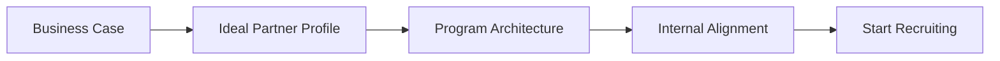

---

title: Partner Strategy Templates
description: PartnerOS template
---

## Recommended Flow

!!! tip "Pro Tip"
    Complete the Business Case and Ideal Partner Profile before recruiting. Skipping strategy leads to signing the wrong partners.
